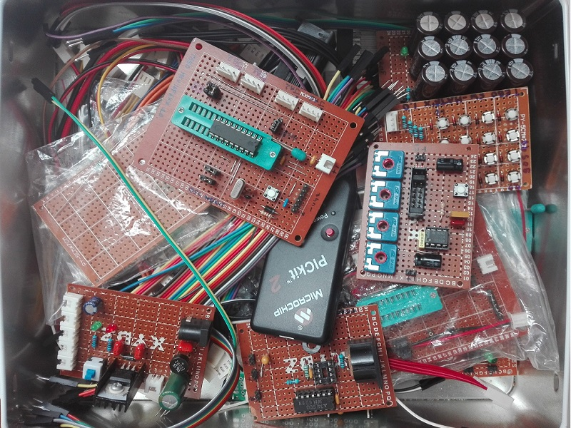

# Electronics Module Boards Library eXPerience
Various modular-designed electronics boards created for home learning projects.

These MOdule Boards (MOBs) are useful for:
* testing specific components functions
* prototyping complex projects by modular approach
* expanding and interfacing components functions
* having fun building simple circuits

## Contents of the MOBs library
* [ExpressPCB custom components library](expresspcb) containing the ExpressPCB files of schematic and pcb components used for drawing the MOBs layout
* [mob-psu-5v](mobs/mob-psu-5v/) : psu 5V module board

### MOBs operating at both 3V3 and 5V
* [mob-psu-distribution](mobs/mob-psu-distribution/) : 8-lines power bus expansion module board
* [mob-io-array-switch-and-led-4x](mobs/mob-io-array-switch-and-led-4x/) : 4-switch input array and 4-led output array module board
* [mob-io-array-led-8x](mobs/mob-io-array-led-8x/) : 8-led output array module board
* [mob-io-array-switch-8x](mobs/mob-io-array-switch-8x/) : 8-switch input array module board
* [mob-io-matrix-switch-4x4](mobs/mob-io-matrix-switch-4x4/) : 4x4 input switch matrix module board
* [mob-io-matrix-led-4x4](mobs/mob-io-matrix-led-4x4/) : 4x4 led matrix module board
* [mob-fn-cbank-26.4mF](mobs/mob-fn-cbank-26.4mF/) : 26400uF Capacitor bank
* [mob-if-midi](mobs/mob-if-midi/) : midi in/out/thru module board

### MOBs operating only at 5V
* [mob-if-rs232](mobs/mob-if-rs232/) : rs232 interface board
* [mob-mcu-pic16f6x8](mobs/mob-mcu-pic16f6x8/) : Microchip PIC 16F6x8 microcontroller module board

## Specifications
Schematics and PCB layouts are designed with ExpressPCB free CAD software.

### MOBs naming convention
* mob (module board)
* mob-psu (power supply unit)
* mob-io (input/output unit)
* mob-if (interface unit)
* mob-fn (function controller unit)
* mob-mcu (micro controller unit)

### PCB Specifications
* PCB layout are designed on paperboard sizes: 2x8cm, 5x7cm, 7x10cm
* Each MOB is designed with the power connector (PWR) with the positive pin on left, a bulk capacitor (C) and a power-on led indicator (DL) (yes, I have surplus of components!)
* Activity leds are:
	* 3mm green led for power status indicator
	* 3/5mm green led for normal activity indicator
	* 3/5mm yellow led for warning status indicator
	* 3/5mm red led for error, fault or wrong status indicator
	* 3/5mm blue led for request of manual intervent
* Led current limiter resistors: R=1Kohm
* Digital line pull-up resistors: R=10Kohm
* IC decoupling capacitors: C=100nF
* Board bulk capacitors: C=10uF

### ExpressPCB Custom Components Library
* ExpressPCB components used for MOBs are customized and named as "_MOB_name__*size*"
* Paperboard layout templates are also saved as ExpressPCB custom components and named as "_MOB__Paperboard_*size*"
* ExpressPCB custom components size units, unless otherwise specified, are 1/10 of inches
* PCB layout traces are 0.05", pads are 0,065"

## Changes
See file [CHANGES](CHANGES.md) for the project resources change log

## Future Plans for the MOBs Library
* Add more MOBs!

## About
Author : Alessandro Fraschetti (mail: [gos95@gommagomma.net](mailto:gos95@gommagomma.net))

## License
This eXPerience is licensed under the [MIT license](LICENSE)
