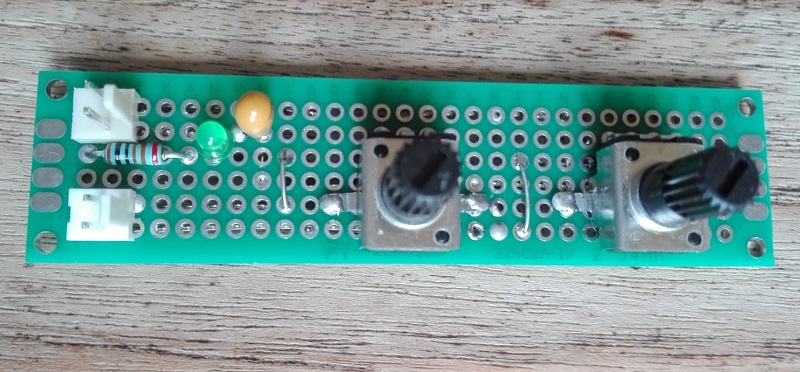
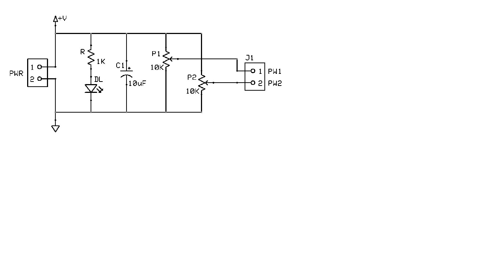

# *Analog Potentiometer* Module Board
2x 10Kohm potentiometers connected with outers terminal between power supply and ground, and wipes to the output.
 
This MOB can operate at both 3V3 and 5V.

## Schematic

## PCB Layout

## Bill of Materials
- [x] paperboard 2x8cm
- [x] 2 x 2-pin (Molex-KK)
- [x] 1 x bulk capacitors (tantalum) 10uF 16V
- [x] led current limiter resistor 1Kohm
- [x] power activity led green 3mm
- [x] 2x 10Kohm potentiometer 