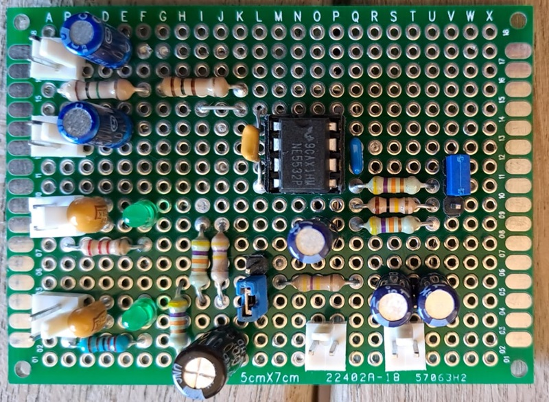
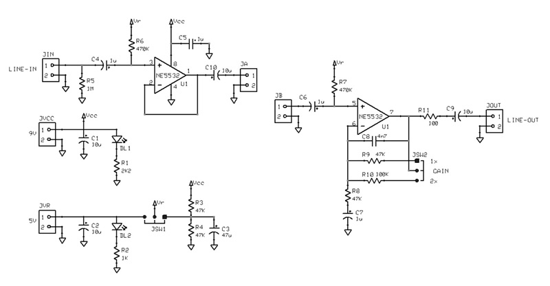
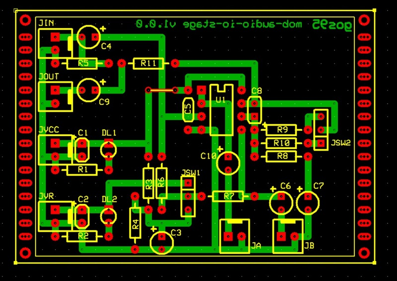

# *Audio I/O Stage* Module Board
Audio input and output stages module board.
This MOB operates at 9V or more for VCC (rail voltage of op-amps) and VCC/2 for internal VR (reference voltage for virtual ground).
The input is a buffer stage, the output stage has a selectable gain (jumper JSW2) between 1:1 or 2:1.

## Schematic

## PCB Layout

## Bill of Materials
- [x] paperboard 5x7cm
- [x] 2-pin (Molex-KK) VCC-GND power connector
- [x] 2-pin (Molex-KK) external VS-GND power connector
- [x] 4 x 2-pin (Molex-KK) input/output audio connector
- [x] 2 x bulk capacitor (tantalum) 10uF
- [x] 2 x led current limiter resistor 2K2Kohm and 1Kohm
- [x] 2 x power activity led green 3mm
- [x] 3-pin voltage VS internal/external selector header
- [x] 3-pin output gain selector header

- [x] 9 x resistors: 1 x 1Mohm, 2 x 470Kohm, 1 x 100Kohm, 4 x 47Kohm, 1 x 100ohm
- [x] 1 x decoupling capacitor C=100nF
- [x] 1 x bulk capacitor 47uF
- [x] 5 x filter capacitor 1 x 10uF, 3 x 1uF, 1 x 4n7F
- [x] IC Dual OpAmp NE5532 with socket DIP4+4