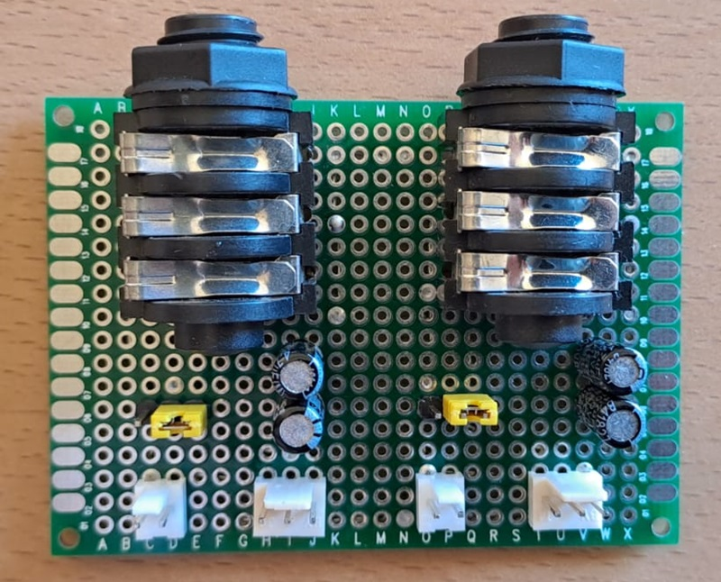
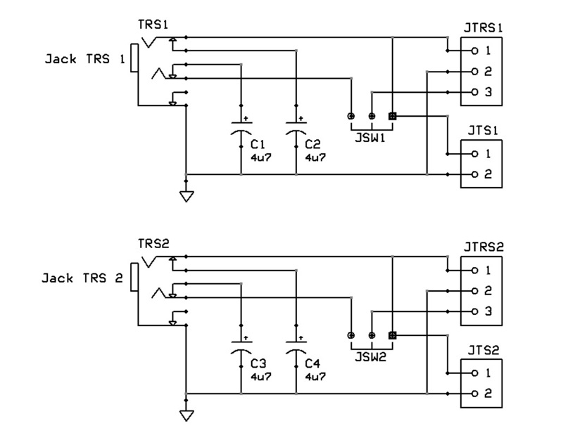
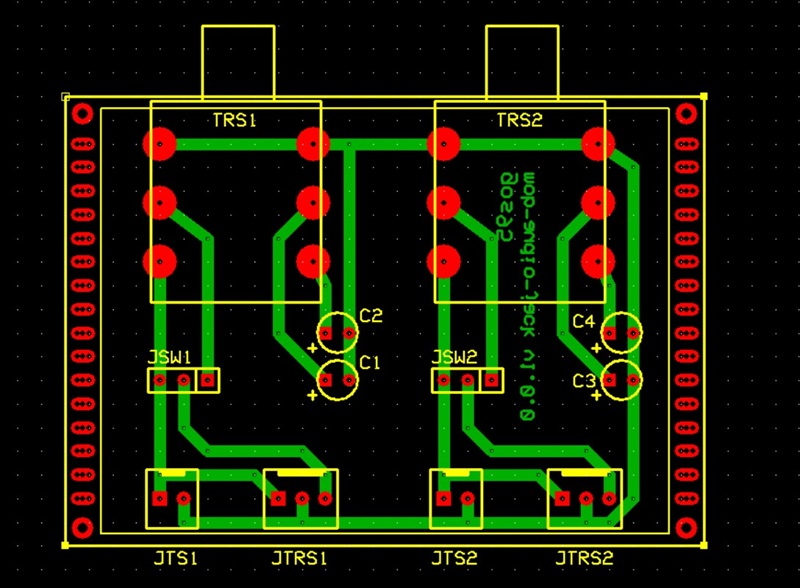

# *Audio Jack* Module Board
Audio TRS jack 1/4" (T = Tip, R = Ring, S = Sleve) connectors module board.

## Schematic

## PCB Layout

## Bill of Materials
- [x] paperboard 5x7cm
- [x] 2 x Connector Jack TRS 6-pin
- [x] 2 x 2-pin (Molex-KK) audio mono connector
- [x] 2 x 3-pin (Molex-KK) audio stereo connector
- [x] 2 x 3-pin TRS L+R/L+L selector header
- [x] 4 x bypass capacitor 4u7F