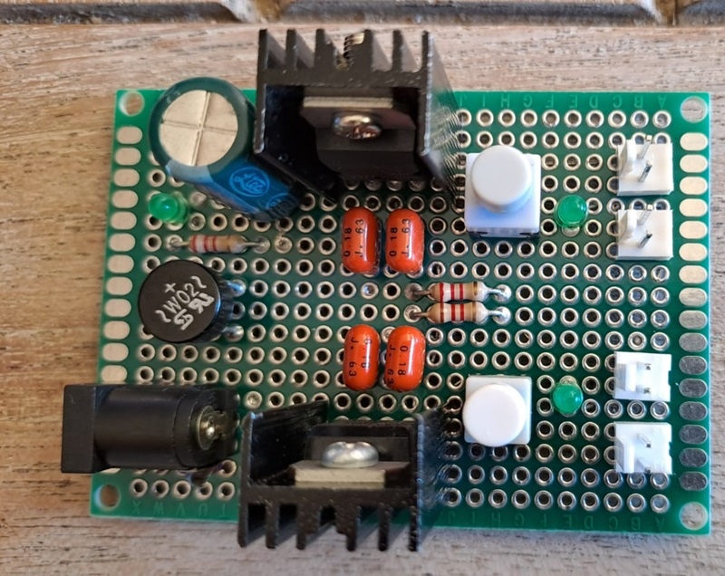
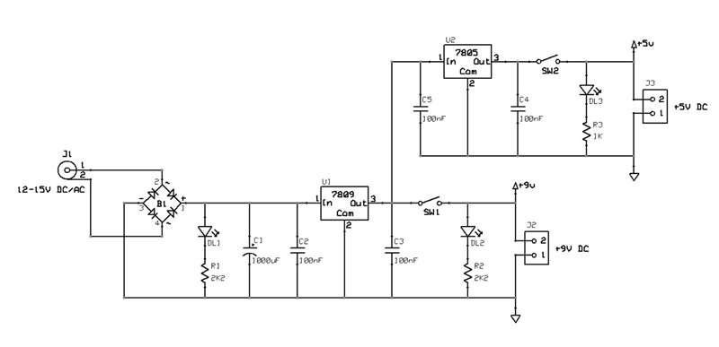
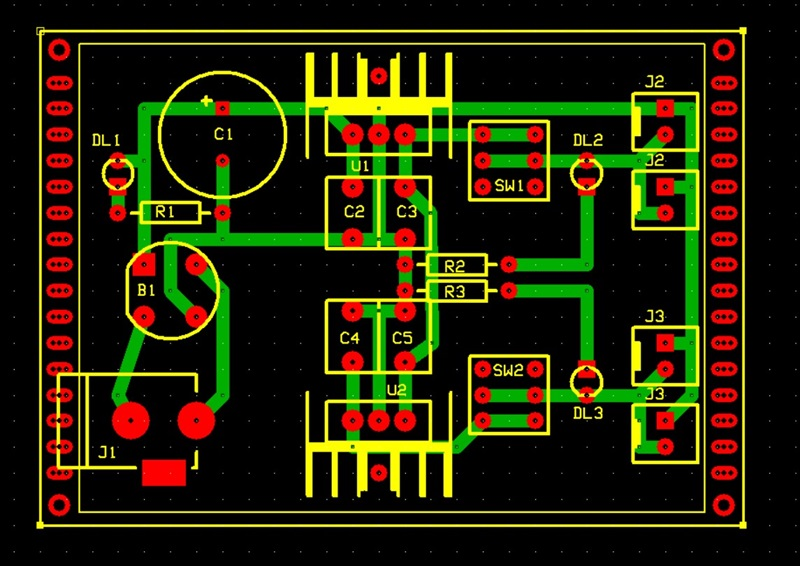

# *Audio PSU 9V 5V* Module Board
9V (VCC), 5V (VR) psu module board.

PSU module for the power supply of the analog audio MOBs operating at VCC=9V and VR=5V.
The module can be powered from 12V to 15V AC or DC, provides stabilized output and delivers a maximum current of about 0.5A.

## Schematic

## PCB Layout

## Bill of Materials
- [x] paperboard 5x7cm
- [x] 5.1 power jack connector
- [x] 3 x led current limiter resistor: 1 x 1Kohm, 2 x 2K2ohm
- [x] 3 x power activity led green 3mm
- [x] 4 x 2-pin (Molex-KK or KF2510) power connector
- [x] filter capacitor 1000uF
- [x] 4 x capacitor 100nF
- [x] 1A diodes bridge
- [x] 7809 voltage regulator TO220 package
- [x] 7805 voltage regulator TO220 package
- [x] 2 x pcb switch