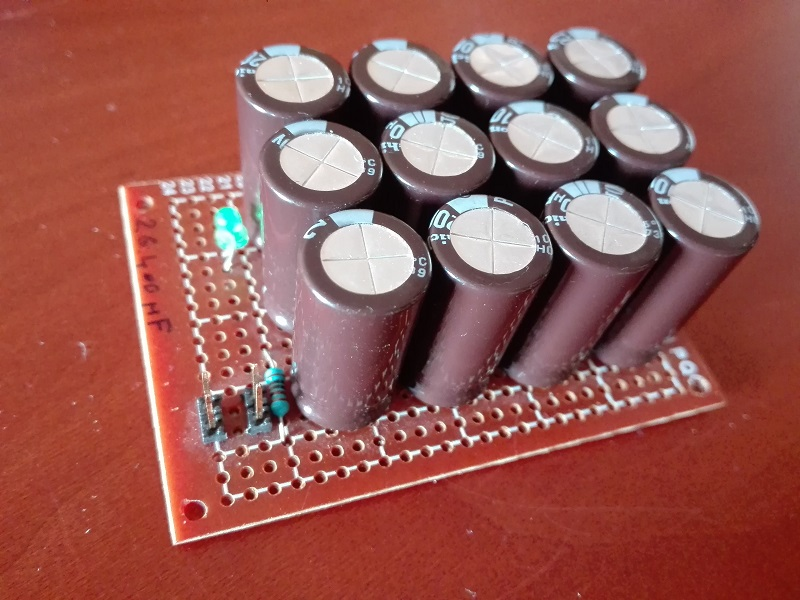
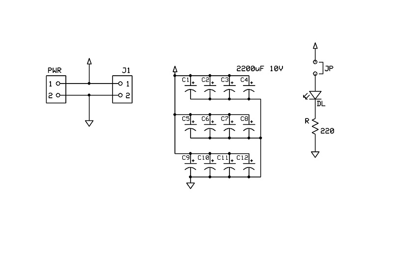
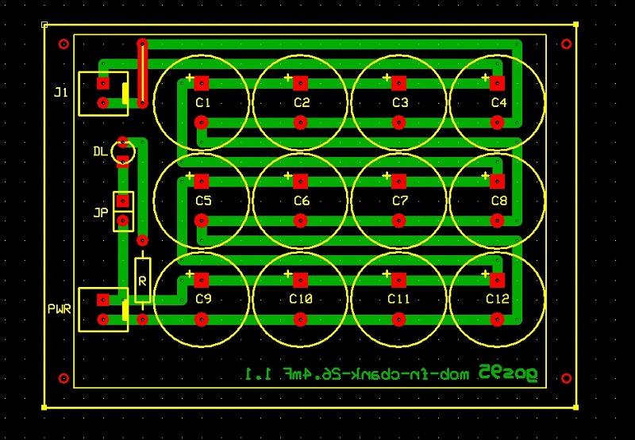

# *C-Bank 26.4mF* Module Board
26400uF Capacitor bank module board.

## Schematic

## PCB Layout

## Bill of Materials
- [x] paperboard 5x7cm
- [x] 2-pin (Molex-KK) power connector
- [x] bulk capacitor (tantalum) 10uF 16V
- [x] led current limiter resistor 1Kohm
- [x] power activity led green 3mm

- [x] 2-pin (Molex-KK) aux connector
- [x] 12x 2200uF capacitors
- [x] 2-pin header connector