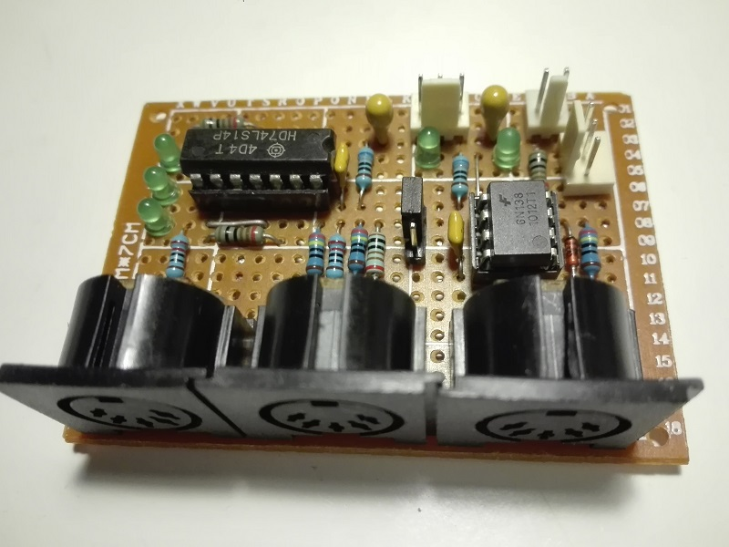
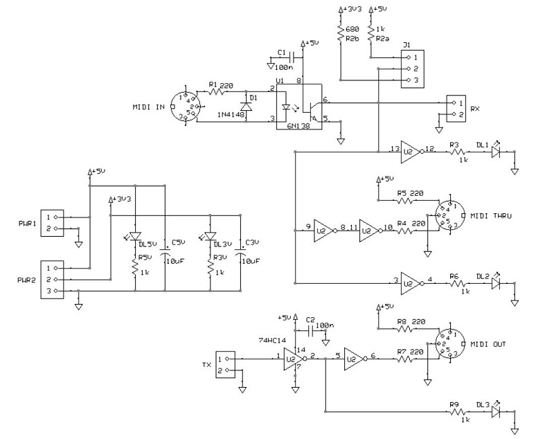
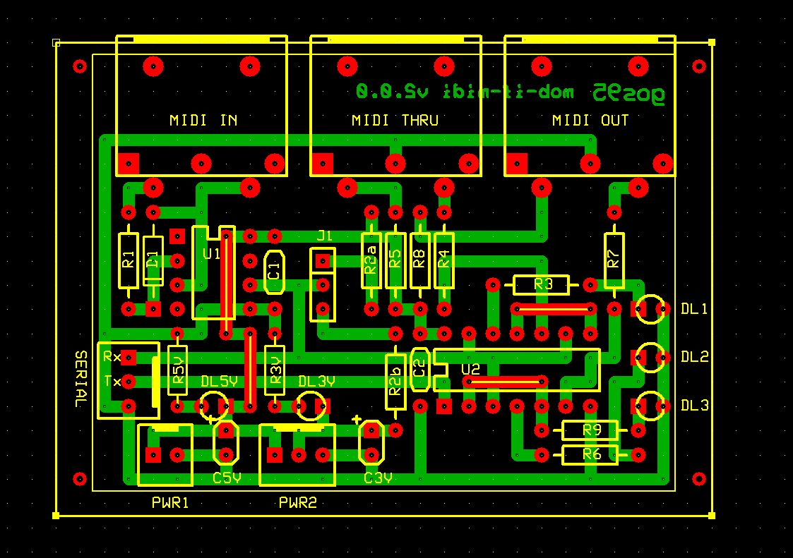

# *MIDI* Module Board
MIDI IN/OUT/THRU module board.
This MOB can operate at both 3V3 and 5V.

## Schematic

## PCB Layout

## Bill of Materials
- [x] paperboard 5x7cm
- [x] 2-pin (Molex-KK) 5V-GND power connector
- [x] 3-pin (Molex-KK) 5V-3.3V-GND power connector
- [x] 2 x bulk capacitor (tantalum) 10uF
- [x] 2 x led current limiter resistor 1Kohm and 680ohm
- [x] 2 x power activity led green 3mm
- [x] 3-pin voltage selection header

- [x] 3-pin (Molex-KK) serial Rx-Tx-GND connector
- [x] 3 x DIN5 pcb connector
- [x] 3 x data activity led current limiter resistors 1Kohm
- [x] 3 x data activity led green 3mm
- [x] 6 x resistors: 5 x 220ohm, 1 x 680ohm
- [x] small signal diode 1N4148
- [x] 2 x decoupling capacitor C=100nF
- [x] IC optocoupler 6N138 with socket DIP4+4
- [x] IC Hex Schmitt-Trigger Inverter 74LS14 with socket DIP7+7