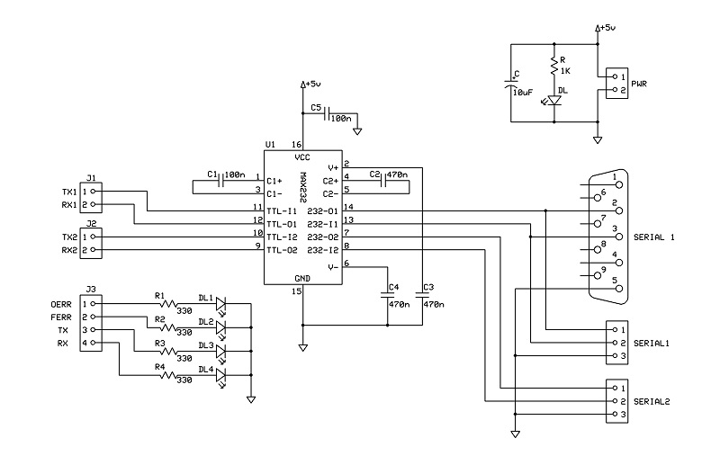
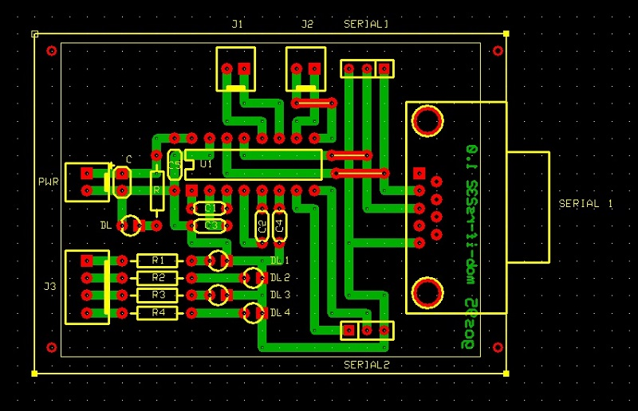

# *RS232 Interface* Module Board
Serial RS232 interface module board.

## Schematic

## PCB Layout

## Bill of Materials
- [x] paperboard 5x7cm
- [x] 2-pin (Molex-KK) power connector
- [x] bulk capacitor (tantalum) 10uF 16V
- [x] led current limiter resistor 1Kohm
- [x] power activity led green 3mm

- [x] 4-pin (Molex-KK) control connector
- [x] 2x2-pin (Molex-KK) TxRx data connectors
- [x] 2x3-pin serial-data header connectors
- [x] 9-pin rs232 serial-data connector
- [x] 5x capacitors (3x 470nF, 2x 100nF)
- [x] 4x serial ctrl activity leds
- [x] 4x current limiter resistors 1Kohm
- [x] IC MAX232