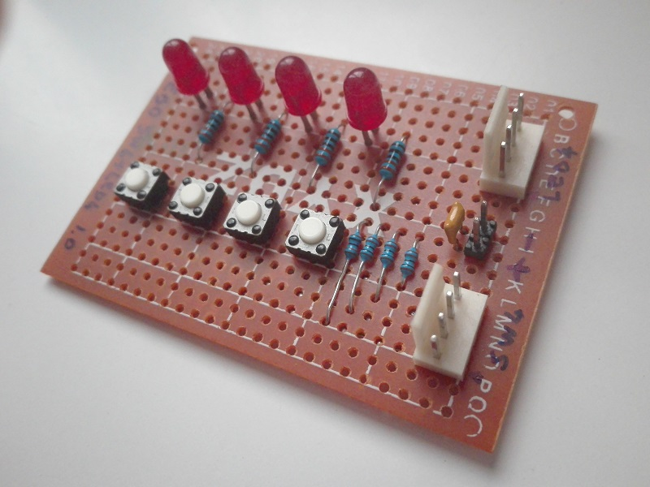
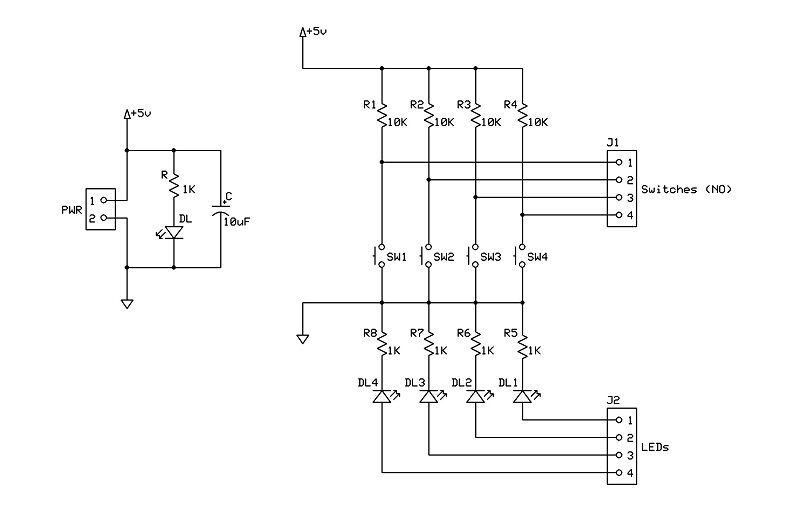
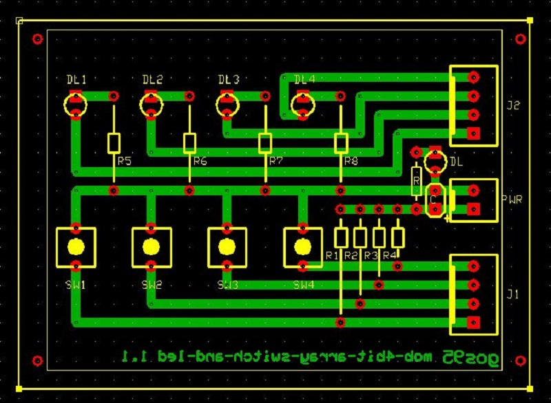

# *I/O Switch & LED arrays* Module Board
4-switch input array and 4-led output array module board.
 
This input/output MOB is composed of two submodules, one consisting of 4 x "active-low" input switches (for each switch current is limited to about 0.5mA on 5V PSU), 
the other consisting of 4 x "active-high" output LEDs (for each LED the current is limited to about 3-4mA on 5V PSU).
This MOB can operate at both 3V3 and 5V.

## Schematic

## PCB Layout

## Bill of Materials
- [x] paperboard 5x7cm
- [x] 2-pin (Molex-KK) power connector
- [x] bulk capacitor (tantalum) 10uF 16V
- [x] led current limiter resistor 1Kohm
- [x] power activity led green 3mm

- [x] 2 x 4-pin (Molex-KK) data connectors
- [x] 4 x data activity led current limiter resistors 1Kohm
- [x] 4 x data activity led green 3mm
- [x] 4 x pull-up resistor 10Kohm
- [x] 4 x data switch SPST (NO)