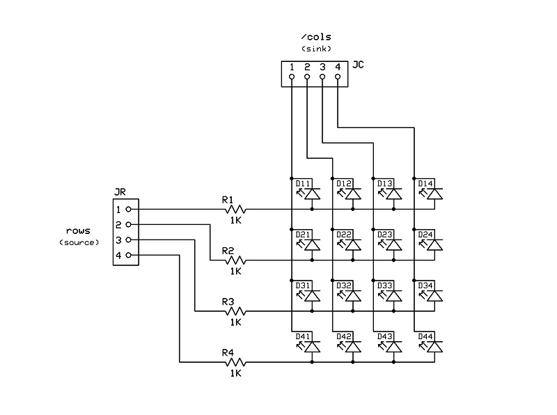
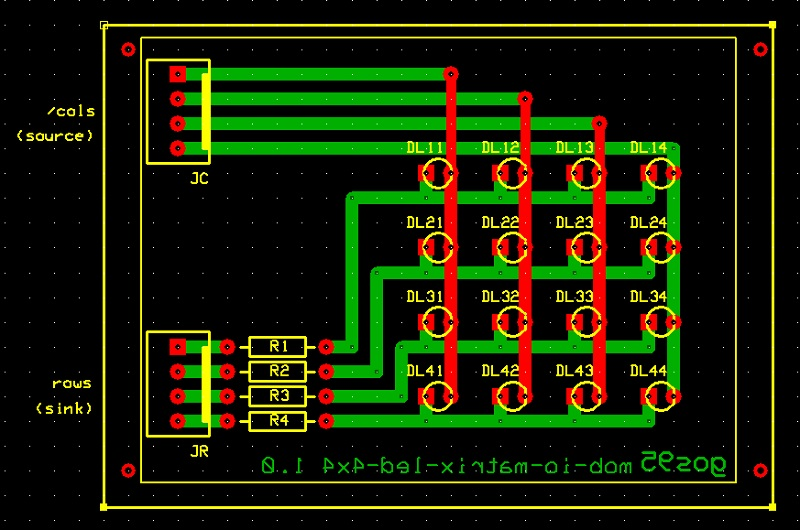

# *4x4 Led Matrix* Module Board
4x4 led switch matrix module board.
This MOB can operate at both 3V3 and 5V.

## Schematic

## PCB Layout

## Bill of Materials
- [x] paperboard 5x7cm
- [x] 2-pin (Molex-KK) power connector
- [x] bulk capacitor (tantalum) 10uF 16V
- [x] led current limiter resistor 1Kohm
- [x] power activity led green 3mm

- [x] 2 x 4-pin (Molex-KK) data (rows, /cols) connectors
- [x] 4 x pull-up resistor 10Kohm
- [x] 16 x small signal diodes
- [x] 16 x switches SPST (NO)