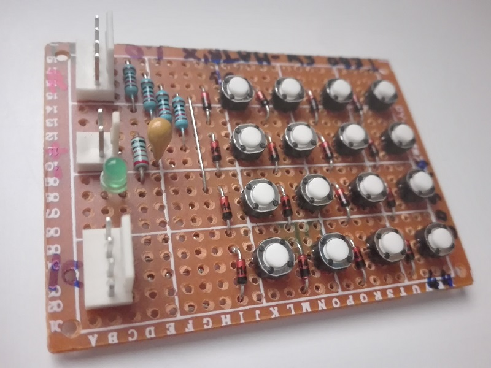
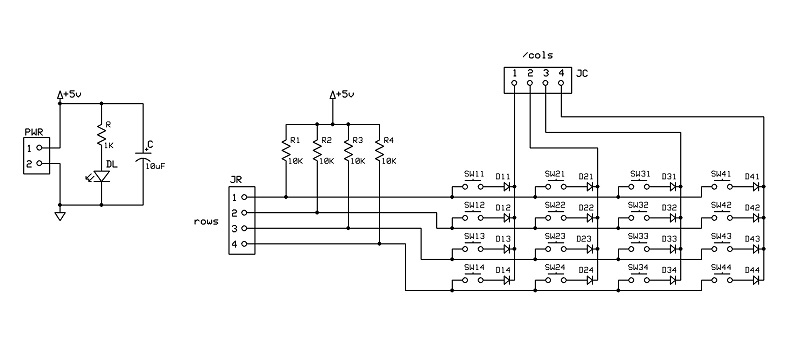
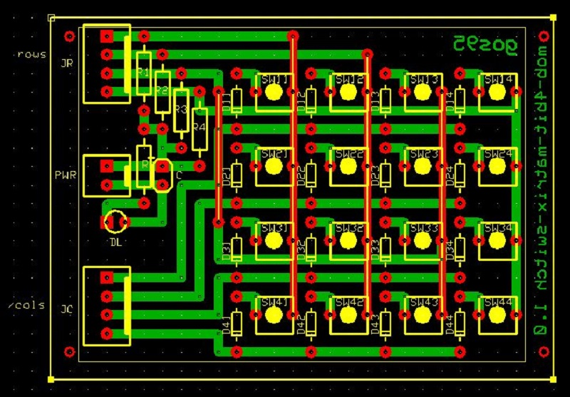

# *4x4 Switch Matrix* Module Board
4x4 input switch matrix module board.

## Schematic

## PCB Layout

## Bill of Materials
- [x] paperboard 5x7cm

- [x] 2 x 4-pin (Molex-KK) data (rows, /cols) connectors
- [x] 4 x led current limiter resistors 10Kohm
- [x] 16 x green 3mm led