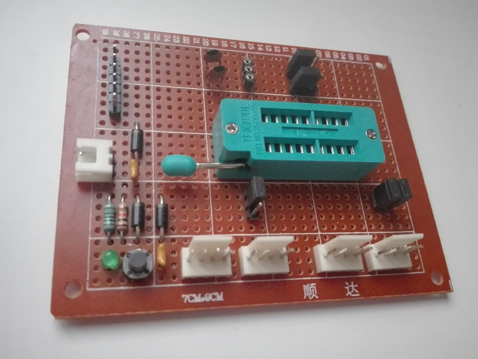
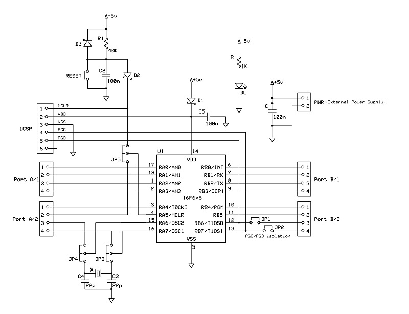
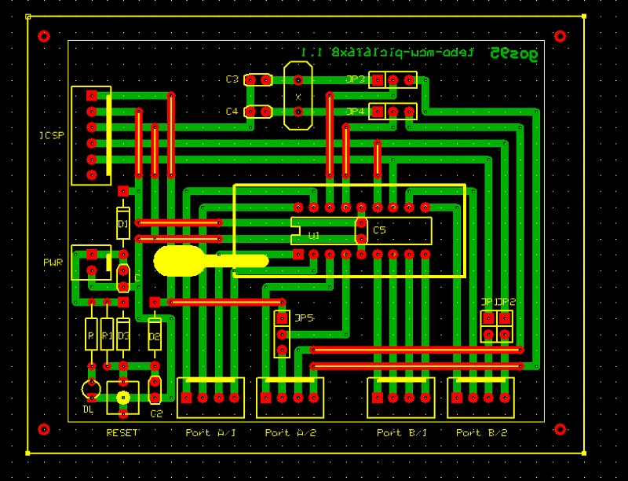

# *MCU PIC16F6x8* Module Board
Microchip PIC 16F6x8 microcontroller module board.

## Schematic

## PCB Layout

## Bill of Materials
- [x] paperboard 5x7cm
- [x] 2-pin (Molex-KK) power connector
- [x] bulk capacitor (tantalum) 10uF 16V
- [x] led current limiter resistor 1Kohm
- [x] power activity led green 3mm

- [x] 4x4-pin (Molex-KK) data connectors
- [x] 2x2-pin  jumper connectors
- [x] 2x3-pin  jumper connectors
- [x] IC DIP18 ZIF socket