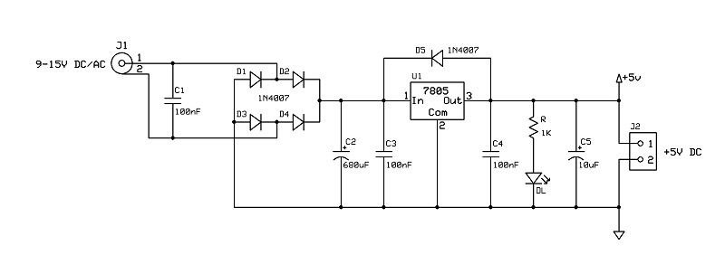
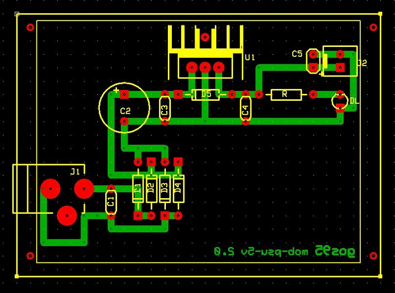

# *PSU 5V* Module Board
5V psu module board.
 
PSU module for the power supply of the MOBs operating at 5V. 
The module can be powered from 9V to 15V, provides stabilized 5V output and delivers a maximum current of about 0.5A.

## Schematic

## PCB Layout

## Bill of Materials
- [x] paperboard 5x7cm
- [x] 5.1 power jack connector
- [x] bulk capacitor (tantalum) 10uF 16V
- [x] led current limiter resistor 1Kohm
- [x] power activity led green 3mm

- [x] 2-pin (Molex-KK) power connector
- [x] filter capacitor 680uF
- [x] 3 x capacitor 100nF
- [x] 5 x 1A diodes
- [x] 7805 voltage regulator